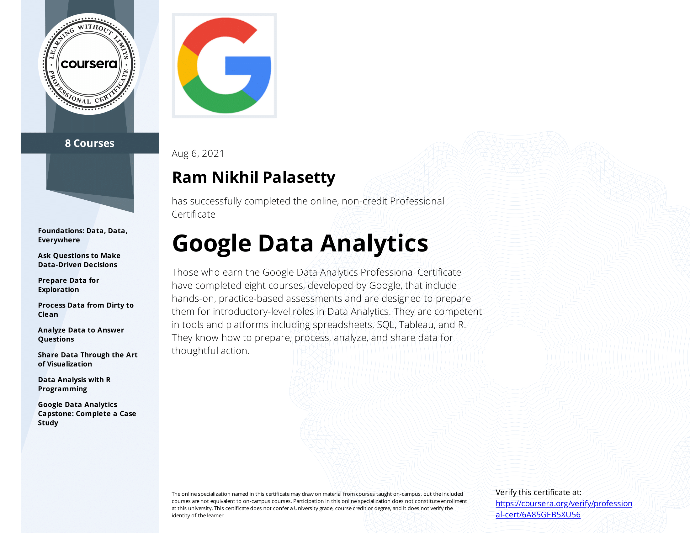

## [Google Data Analytics Professional Certificate](https://www.coursera.org/professional-certificates/google-data-analytics)

&nbsp;

* This repository written for reference and self-documentation purpose

Data analytics is the collection, transformation, and organization of data in order to draw conclusions, make predictions, and drive informed decision making. 

Over 8 courses, I gain in-demand skills that prepare for an entry-level Data analyst job. I learnt from Google employees whose foundations in data analytics served as launchpads for my own careers. 

